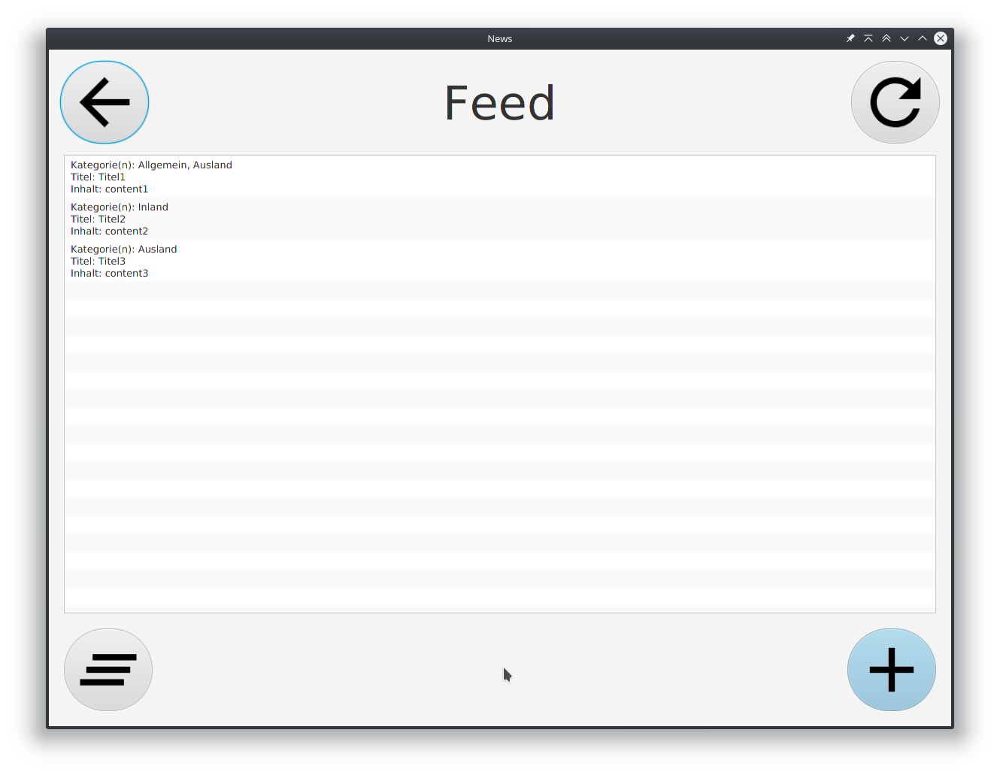

# Modul 120 Projektarbeit
Modul 120 - Benutzerschnittstellen implementieren - Projektarbeit - https://sites.google.com/a/gibmit.ch/modul-120-hs2019-q2/projektarbeit-teil-3

#### GitHub Client Proxy konfigurieren
``git config --global http.proxy http://172.20.10.11:3128``

## Screenshots

